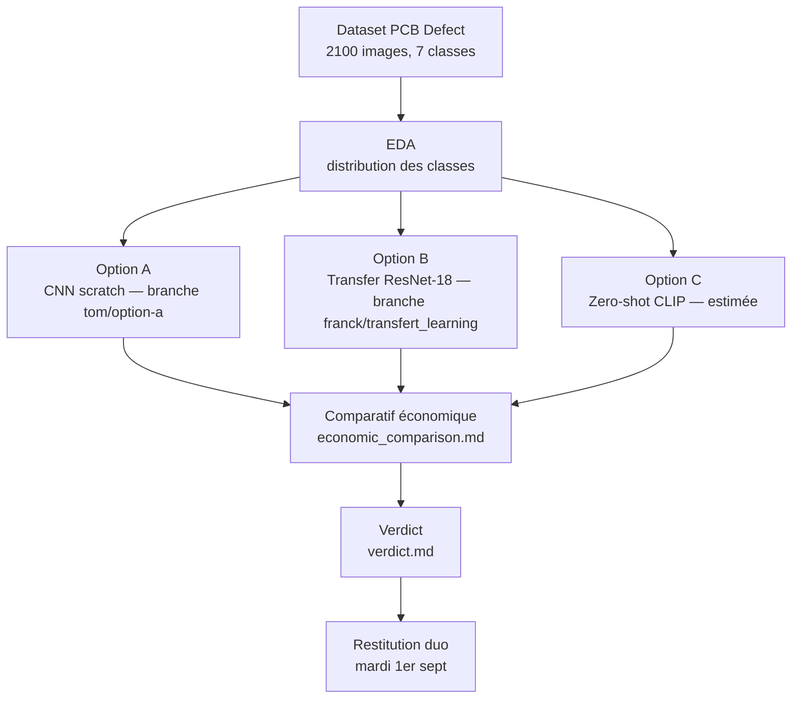

# M4-B2 — Squelette repo (vision PCB Defect — binôme async)

> Détection automatique de défauts qualité sur cartes PCB pour TechniMatic
> Comparatif de 3 approches vision : CNN from scratch (A), transfer learning RestNet-18 (B), zero-shot CLIP (C, estimée).

---

## 🚀 Reproduire en 3 commandes

```bash
git clone https://github.com/A949196/m4-b2_tom_franck.git && cd m4-b2_tom_franck
pip install torch torchvision --index-url https://download.pytorch.org/whl/cpu && pip install -r requirements.txt
python scripts/generate_dataset.py && jupyter notebook notebooks/M4-B2_template.ipynb
```

> 📦 Les ~2 100 images PCB (7 classes = 6 défauts + 1 OK, 64×64) sont **générées par
> `scripts/generate_dataset.py`** dans `data/pcb_defect_sample/`. Synthétiques,
> déterministes (seed 42), générées localement - non commitées.
---

## 🧭 Schéma de la démarche
 


---

## 📊 Résultats mesurés (résumé)
 
| Critère | Option A (CNN scratch) | Option B (Transfer ResNet-18) | Option C (CLIP, estimée) |
|---|---|---|---|
| Temps train (CPU) | 9,6 s | 610,8 s | 0 s |
| Latence inférence (CPU) | 0,41 ms/image | 56,53 ms/image | ~80-150 ms (estimé) |
| Accuracy test | 57,5 % | 56,2 % | ~20-40 % (estimé) |
| Taille modèle | 2,09 Mo | 42,65 Mo | ~150 Mo |
 
Détail complet et sources des estimations : [`economic_comparison.md`](./economic_comparison.md).
Recommandation finale et conditions de changement d'avis : [`verdict.md`](./verdict.md).
 
---

## 📁 Structure du repo
 
```
m4-b2_tom_franck/
├── scripts/
│   └── generate_dataset.py              # génère les images PCB (seed 42)
├── data/                                # gitignored
│   └── pcb_defect_sample/               # produit par le script
│       ├── ok/ open/ short/ ...         # 7 classes
├── notebooks/
│   └── M4-B2_template.ipynb             # EDA + entraînement + éval (A et B)
├── src/
│   ├── load_data.py                     # Dataset PyTorch + dataloaders
│   ├── option_a_cnn.py                  # CNN from scratch — implémenté
│   ├── option_b_transfer.py             # ResNet-18 transfer — implémenté
│   └── option_c_clip.py                 # CLIP zero-shot — non implémenté (estimé)
├── models/                               # gitignored
├── ressources/                          # 📚 6 mini-cours
├── decisions.md                         # choix, répartition, points négociés
├── economic_comparison.md               # comparatif chiffré des 3 approches
├── verdict.md                           # recommandation (max 8 lignes)
├── requirements.txt
└── .gitignore
```

---

## ✅ Conventions de code

- Python 3.11+, type hints
- `Co-authored-by:` sur les commits significatifs
- Branches nominatives `<prénom>/<feature>`
- Test croisé : chacun clone et fait tourner le code de l'autre

---

## 🆘 Bloqué·e·s ?

1. Relisez le mini-cours de l'option choisie.
2. **Sur PyTorch** : `device = "cpu"` est OK (volume limité). Pas besoin
   de GPU.
3. **Sur CLIP** : ~150 Mo de téléchargement au 1ᵉʳ appel — patience.
4. **Si binôme stuck à 2** : un fait un mini-prototype et MP voix, l'autre
   prend le clavier. Switch.
5. Demande sur Discord (`fil-M4-B2`).
